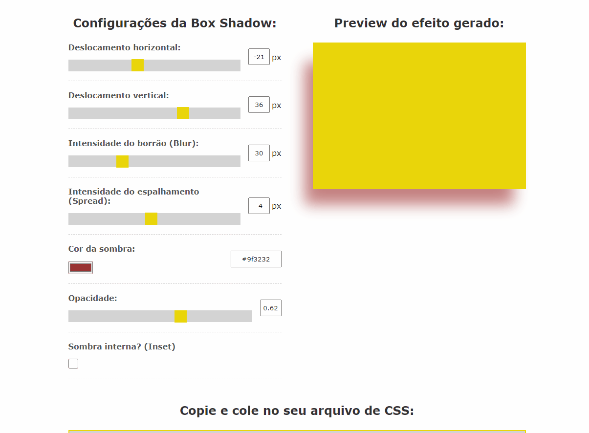

# Box Shadow Generator

▶ Trata-se de um gerador de Box Shadow, que serve para facilitar a vida do desenvolvedor, assim ele podendo criar sua box-shadow com mais facilidade, vendo o resultado enquanto cria ela.

Com esta ferramenta você consegue gerar de forma visual a regra de CSS box-shadow para qualquer elemento, e receber ela de forma que funcione em qualquer navegador.

Por ter muitos parâmetros a box-shadow é uma regra de difícil execução no CSS, resultando em várias tentativas e erros, a ferramenta ajuda a deixar mais fácil você atingir seu objetivo.

## Tecnológias Utilizadas

- HTML
- CSS
- JavaScript